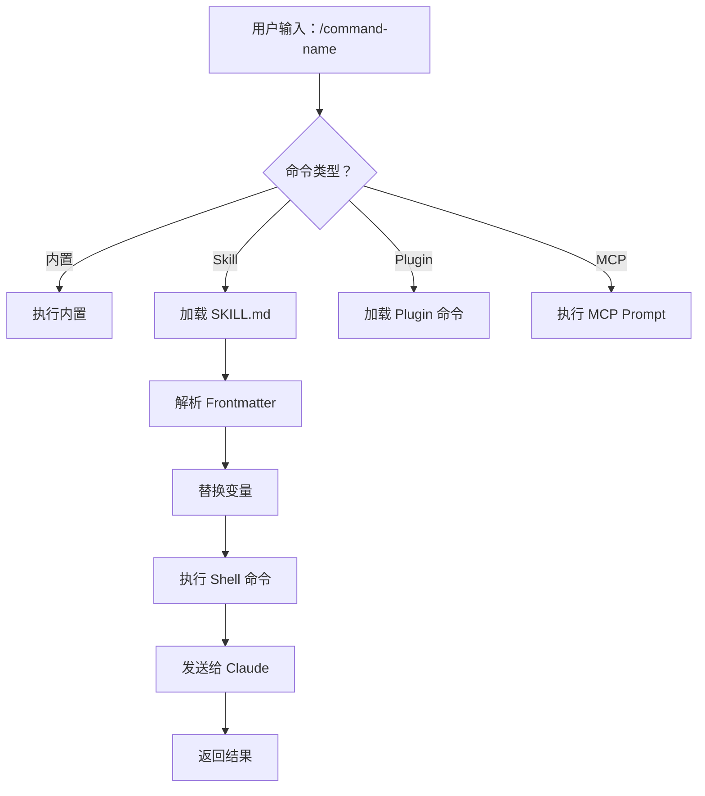
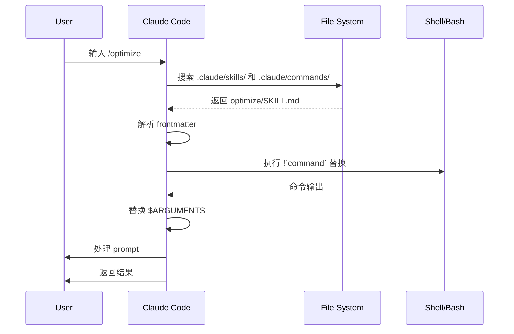

<picture>
  <source media="(prefers-color-scheme: dark)" srcset="../resources/logos/claude-howto-logo-dark.svg">
  
</picture>

# Slash Commands（斜杠命令）

## 概述

Slash commands（斜杠命令）是在交互式会话期间控制 Claude 行为的快捷方式。它们有几种类型：

- **内置命令**：由 Claude Code 提供（`/help`、`/clear`、`/model`）
- **Skills**：创建为 `SKILL.md` 文件的用户自定义命令（`/optimize`、`/pr`）
- **Plugin 命令**：已安装插件提供的命令（`/frontend-design:frontend-design`）
- **MCP prompts**：MCP servers 提供的命令（`/mcp__github__list_prs`）

> **注意**：自定义 slash commands 已被合并到 skills 中。`.claude/commands/` 中的文件仍然可以工作，但 skills（`.claude/skills/`）现在是推荐的方法。两者都会创建 `/command-name` 快捷方式。请参阅 [Skills 指南](../03-skills/) 获取完整参考。

## 内置命令参考

内置命令是常见操作的快捷方式。有 **55+ 个内置命令** 和 **5 个捆绑 skills** 可用。在 Claude Code 中输入 `/` 查看完整列表，或输入 `/` 后跟任意字母进行筛选。

| 命令 | 用途 |
|---------|---------|
| `/add-dir <path>` | 添加工作目录 |
| `/agents` | 管理 agent 配置 |
| `/branch [name]` | 将对话分支到新会话（别名：`/fork`）。注：`/fork` 在 v2.1.77 中重命名为 `/branch` |
| `/btw <question>` | 侧问而不添加到历史记录 |
| `/chrome` | 配置 Chrome 浏览器集成 |
| `/clear` | 清除对话（别名：`/reset`、`/new`）|
| `/color [color\|default]` | 设置提示栏颜色 |
| `/compact [instructions]` | 压缩对话，可选聚焦指令 |
| `/config` | 打开设置（别名：`/settings`）|
| `/context` | 将上下文使用情况可视化为彩色网格 |
| `/copy [N]` | 将助手响应复制到剪贴板；`w` 写入文件 |
| `/cost` | 显示 token 使用统计 |
| `/desktop` | 在桌面应用中继续（别名：`/app`）|
| `/diff` | 未提交更改的交互式差异查看器 |
| `/doctor` | 诊断安装健康状态 |
| `/effort [low\|medium\|high\|max\|auto]` | 设置 effort 级别。`max` 需要 Opus 4.6 |
| `/exit` | 退出 REPL（别名：`/quit`）|
| `/export [filename]` | 将当前对话导出到文件或剪贴板 |
| `/extra-usage` | 配置额外使用限制以应对速率限制 |
| `/fast [on\|off]` | 切换快速模式 |
| `/feedback` | 提交反馈（别名：`/bug`）|
| `/help` | 显示帮助 |
| `/hooks` | 查看 hook 配置 |
| `/ide` | 管理 IDE 集成 |
| `/init` | 初始化 `CLAUDE.md`。设置 `CLAUDE_CODE_NEW_INIT=true` 以启用交互式流程 |
| `/insights` | 生成会话分析报告 |
| `/install-github-app` | 设置 GitHub Actions 应用 |
| `/install-slack-app` | 安装 Slack 应用 |
| `/keybindings` | 打开键位绑定配置 |
| `/login` | 切换 Anthropic 账户 |
| `/logout` | 从 Anthropic 账户登出 |
| `/mcp` | 管理 MCP servers 和 OAuth |
| `/memory` | 编辑 `CLAUDE.md`，切换自动内存 |
| `/mobile` | 移动应用的 QR 码（别名：`/ios`、`/android`）|
| `/model [model]` | 使用左右箭头选择模型和 effort |
| `/passes` | 分享 Claude Code 免费周 |
| `/permissions` | 查看/更新权限（别名：`/allowed-tools`）|
| `/plan [description]` | 进入规划模式 |
| `/plugin` | 管理 plugins |
| `/pr-comments [PR]` | 获取 GitHub PR 评论 |
| `/privacy-settings` | 隐私设置（仅 Pro/Max）|
| `/release-notes` | 查看更新日志 |
| `/reload-plugins` | 重新加载活动的 plugins |
| `/remote-control` | 从 claude.ai 进行远程控制（别名：`/rc`）|
| `/remote-env` | 配置默认远程环境 |
| `/rename [name]` | 重命名会话 |
| `/resume [session]` | 恢复对话（别名：`/continue`）|
| `/review` | **已弃用** — 请改为安装 `code-review` plugin |
| `/rewind` | 回退对话和/或代码（别名：`/checkpoint`）|
| `/sandbox` | 切换沙盒模式 |
| `/schedule [description]` | 创建/管理计划任务 |
| `/security-review` | 分析分支的安全漏洞 |
| `/skills` | 列出可用的 skills |
| `/stats` | 可视化每日使用情况、会话、连续天数 |
| `/status` | 显示版本、模型、账户 |
| `/statusline` | 配置状态行 |
| `/tasks` | 列出/管理后台任务 |
| `/terminal-setup` | 配置终端键位绑定 |
| `/theme` | 更改颜色主题 |
| `/vim` | 切换 Vim/Normal 模式 |
| `/voice` | 切换按键即说语音输入 |

### 捆绑 Skills

这些 skills 随 Claude Code 一起提供，并像 slash commands 一样调用：

| Skill | 用途 |
|-------|---------|
| `/batch <instruction>` | 使用 worktrees 编排大规模并行更改 |
| `/claude-api` | 为项目语言加载 Claude API 参考 |
| `/debug [description]` | 启用调试日志 |
| `/loop [interval] <prompt>` | 按间隔重复运行 prompt |
| `/simplify [focus]` | 审查已更改文件的代码质量 |

### 已弃用的命令

| 命令 | 状态 |
|---------|--------|
| `/review` | 已弃用 — 被 `code-review` plugin 取代 |
| `/output-style` | 自 v2.1.73 起已弃用 |
| `/fork` | 重命名为 `/branch`（别名仍然有效，v2.1.77）|

### 最近更改

- `/fork` 重命名为 `/branch`，`/fork` 保持为别名（v2.1.77）
- `/output-style` 已弃用（v2.1.73）
- `/review` 已弃用，改用 `code-review` plugin
- 添加了 `/effort` 命令，`max` 级别需要 Opus 4.6
- 添加了 `/voice` 命令用于按键即说语音输入
- 添加了 `/schedule` 命令用于创建/管理计划任务
- 添加了 `/color` 命令用于提示栏自定义
- `/model` 选择器现在显示人类可读的标签（如 "Sonnet 4.6"）而不是原始模型 ID
- `/resume` 支持 `/continue` 别名
- MCP prompts 可用作 `/mcp__<server>__<prompt>` 命令（参见 [MCP Prompts 作为命令](#mcp-prompts-as-commands)）

## 自定义命令（现在是 Skills）

自定义 slash commands 已被**合并到 skills**。两种方法都会创建可以使用 `/command-name` 调用的命令：

| 方法 | 位置 | 状态 |
|----------|----------|--------|
| **Skills（推荐）** | `.claude/skills/<name>/SKILL.md` | 当前标准 |
| **遗留命令** | `.claude/commands/<name>.md` | 仍然有效 |

如果 skill 和 command 使用相同的名称，**skill 优先**。例如，当 `.claude/commands/review.md` 和 `.claude/skills/review/SKILL.md` 都存在时，将使用 skill 版本。

### 迁移路径

您现有的 `.claude/commands/` 文件无需更改即可继续工作。要迁移到 skills：

**之前（Command）：**
```
.claude/commands/optimize.md
```

**之后（Skill）：**
```
.claude/skills/optimize/SKILL.md
```

### 为什么使用 Skills？

Skills 相比遗留命令提供额外功能：

- **目录结构**：捆绑脚本、模板和参考文件
- **自动调用**：Claude 可以在相关时自动触发 skills
- **调用控制**：选择用户、Claude 或两者都可以调用
- **Subagent 执行**：使用 `context: fork` 在隔离的上下文中运行 skills
- **渐进式披露**：仅在需要时加载额外文件

### 将自定义命令创建为 Skill

创建带有 `SKILL.md` 文件的目录：

```bash
mkdir -p .claude/skills/my-command
```

**文件：** `.claude/skills/my-command/SKILL.md`

```yaml
---
name: my-command
description: 这个命令做什么以及何时使用
---

# My Command

调用此命令时 Claude 遵循的指令。

1. 第一步
2. 第二步
3. 第三步
```

### Frontmatter 参考

| 字段 | 用途 | 默认值 |
|-------|---------|---------|
| `name` | 命令名称（成为 `/name`）| 目录名称 |
| `description` | 简要描述（帮助 Claude 知道何时使用）| 第一段 |
| `argument-hint` | 自动补全的预期参数 | 无 |
| `allowed-tools` | 命令可以在没有权限的情况下使用的工具 | 继承 |
| `model` | 使用的特定模型 | 继承 |
| `disable-model-invocation` | 如果为 `true`，仅用户可以调用（不是 Claude）| `false` |
| `user-invocable` | 如果为 `false`，从 `/` 菜单隐藏 | `true` |
| `context` | 设置为 `fork` 以在隔离的 subagent 中运行 | 无 |
| `agent` | 使用 `context: fork` 时的 agent 类型 | `general-purpose` |
| `hooks` | Skill 范围内的 hooks（PreToolUse、PostToolUse、Stop）| 无 |

### 参数

命令可以接收参数：

**所有参数与 `$ARGUMENTS`：**

```yaml
---
name: fix-issue
description: 按编号修复 GitHub issue
---

按照我们的编码标准修复 issue #$ARGUMENTS
```

用法：`/fix-issue 123` → `$ARGUMENTS` 变为 "123"

**单独参数与 `$0`、`$1` 等：**

```yaml
---
name: review-pr
description: 带优先级的 PR 审查
---

审查 PR #$0，优先级 $1
```

用法：`/review-pr 456 high` → `$0`="456", `$1`="high"

### 使用 Shell 命令的动态上下文

使用 `!`command`` 在 prompt 之前执行 bash 命令：

```yaml
---
name: commit
description: 带上下文的 git 提交
allowed-tools: Bash(git *)
---

## 上下文

- 当前 git 状态： !`git status`
- 当前 git 差异： !`git diff HEAD`
- 当前分支： !`git branch --show-current`
- 最近提交： !`git log --oneline -5`

## 你的任务

根据上述更改，创建单个 git 提交。
```

### 文件引用

使用 `@` 包含文件内容：

```markdown
审查 @src/utils/helpers.js 中的实现
将 @src/old-version.js 与 @src/new-version.js 进行比较
```

## Plugin 命令

Plugins 可以提供自定义命令：

```
/plugin-name:command-name
```

或者当没有命名冲突时简单地使用 `/command-name`。

**示例：**
```bash
/frontend-design:frontend-design
/commit-commands:commit
```

## MCP Prompts 作为命令

MCP servers 可以将 prompts 公开为 slash commands：

```
/mcp__<server-name>__<prompt-name> [arguments]
```

**示例：**
```bash
/mcp__github__list_prs
/mcp__github__pr_review 456
/mcp__jira__create_issue "Bug title" high
```

### MCP 权限语法

在权限中控制 MCP server 访问：

- `mcp__github` - 访问整个 GitHub MCP server
- `mcp__github__*` - 通配符访问所有工具
- `mcp__github__get_issue` - 特定工具访问

## 命令架构



## 命令生命周期



## 本文件夹中的可用命令

这些示例命令可以安装为 skills 或遗留命令。

### 1. `/optimize` - 代码优化

分析代码的性能问题、内存泄漏和优化机会。

**用法：**
```
/optimize
[粘贴你的代码]
```

### 2. `/pr` - Pull Request 准备

引导完成 PR 准备清单，包括 linting、测试和提交格式化。

**用法：**
```
/pr
```

**截图：**


### 3. `/generate-api-docs` - API 文档生成器

从源代码生成全面的 API 文档。

**用法：**
```
/generate-api-docs
```

### 4. `/commit` - 带上下文的 Git 提交

从您的仓库创建带动态上下文的 git 提交。

**用法：**
```
/commit [可选消息]
```

### 5. `/push-all` - 暂存、提交并推送

暂存所有更改，创建提交，并推送到远程，带安全检查。

**用法：**
```
/push-all
```

**安全检查：**
- 密钥：`.env*`、`*.key`、`*.pem`、`credentials.json`
- API 密钥：检测真实密钥与占位符
- 大文件：`>10MB` 无 Git LFS
- 构建产物：`node_modules/`、`dist/`、`__pycache__/`

### 6. `/doc-refactor` - 文档重构

重构项目文档以提高清晰度和可访问性。

**用法：**
```
/doc-refactor
```

### 7. `/setup-ci-cd` - CI/CD 流水线设置

实现 pre-commit hooks 和 GitHub Actions 以确保质量。

**用法：**
```
/setup-ci-cd
```

### 8. `/unit-test-expand` - 测试覆盖扩展

通过针对未测试的分支和边缘情况来增加测试覆盖。

**用法：**
```
/unit-test-expand
```

## 安装

### 作为 Skills（推荐）

复制到您的 skills 目录：

```bash
# 创建 skills 目录
mkdir -p .claude/skills

# 对于每个命令文件，创建 skill 目录
for cmd in optimize pr commit; do
  mkdir -p .claude/skills/$cmd
  cp 01-slash-commands/$cmd.md .claude/skills/$cmd/SKILL.md
done
```

### 作为遗留命令

复制到您的 commands 目录：

```bash
# 项目范围（团队）
mkdir -p .claude/commands
cp 01-slash-commands/*.md .claude/commands/

# 个人使用
mkdir -p ~/.claude/commands
cp 01-slash-commands/*.md ~/.claude/commands/
```

## 创建您自己的命令

### Skill 模板（推荐）

创建 `.claude/skills/my-command/SKILL.md`：

```yaml
---
name: my-command
description: 这个命令做什么。适用于 [触发条件]。
argument-hint: [可选参数]
allowed-tools: Bash(npm *), Read, Grep
---

# 命令标题

## 上下文

- 当前分支： !`git branch --show-current`
- 相关文件： @package.json

## 指令

1. 第一步
2. 第二步，参数：$ARGUMENTS
3. 第三步

## 输出格式

- 如何格式化响应
- 包含什么
```

### 仅用户命令（无自动调用）

对于有副作用的 Claude 不应自动触发的命令：

```yaml
---
name: deploy
description: 部署到生产环境
disable-model-invocation: true
allowed-tools: Bash(npm *), Bash(git *)
---

将应用部署到生产环境：

1. 运行测试
2. 构建应用
3. 推送到部署目标
4. 验证部署
```

## 最佳实践

| 应该做 | 不应该做 |
|------|---------|
| 使用清晰、以动作为导向的名称 | 为一次性任务创建命令 |
| 包含带有触发条件的 `description` | 在命令中构建复杂逻辑 |
| 保持命令专注于单一任务 | 硬编码敏感信息 |
| 对副作用使用 `disable-model-invocation` | 跳过 description 字段 |
| 使用 `!` 前缀获取动态上下文 | 假设 Claude 知道当前状态 |
| 在 skill 目录中组织相关文件 | 将所有内容放在一个文件中 |

## 故障排除

### 找不到命令

**解决方案：**
- 检查文件是否在 `.claude/skills/<name>/SKILL.md` 或 `.claude/commands/<name>.md`
- 验证 frontmatter 中的 `name` 字段与预期的命令名称匹配
- 重新启动 Claude Code 会话
- 运行 `/help` 查看可用命令

### 命令未按预期执行

**解决方案：**
- 添加更具体的指令
- 在 skill 文件中包含示例
- 如果使用 bash 命令，检查 `allowed-tools`
- 先用简单输入测试

### Skill 与 Command 冲突

如果两者以相同名称存在，**skill 优先**。删除其中一个或重命名。

## 相关指南

- **[Skills](../03-skills/)** — skills 完整参考（自动调用能力）
- **[Memory](../02-memory/)** — 通过 CLAUDE.md 持久化上下文
- **[Subagents](../04-subagents/)** — 委托的 AI agents
- **[Plugins](../07-plugins/)** — 捆绑的命令集合
- **[Hooks](../06-hooks/)** — 事件驱动自动化

## 额外资源

- [官方交互模式文档](https://code.claude.com/docs/en/interactive-mode) — 内置命令参考
- [官方 Skills 文档](https://code.claude.com/docs/en/skills) — 完整 skills 参考
- [CLI 参考](https://code.claude.com/docs/en/cli-reference) — 命令行选项

---

*Part of the [Claude How To](../) guide series*

---

> **中文适配说明**：本文档由 [claude-howto](https://github.com/BuaaJoseph/claude-howto) 翻译而来，保留了英文技术术语（如 slash commands、skills、hooks、MCP 等）。原文采用 MIT 许可证。