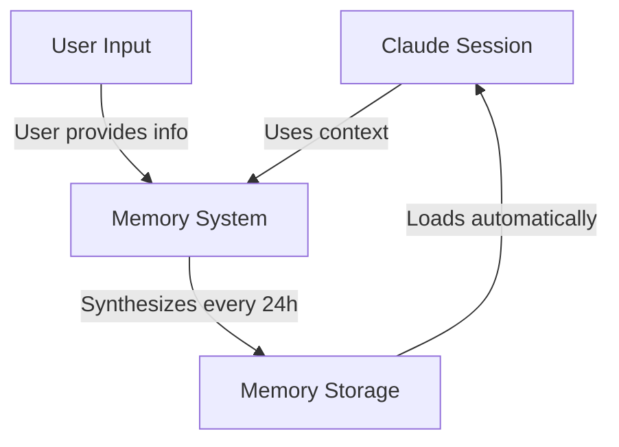
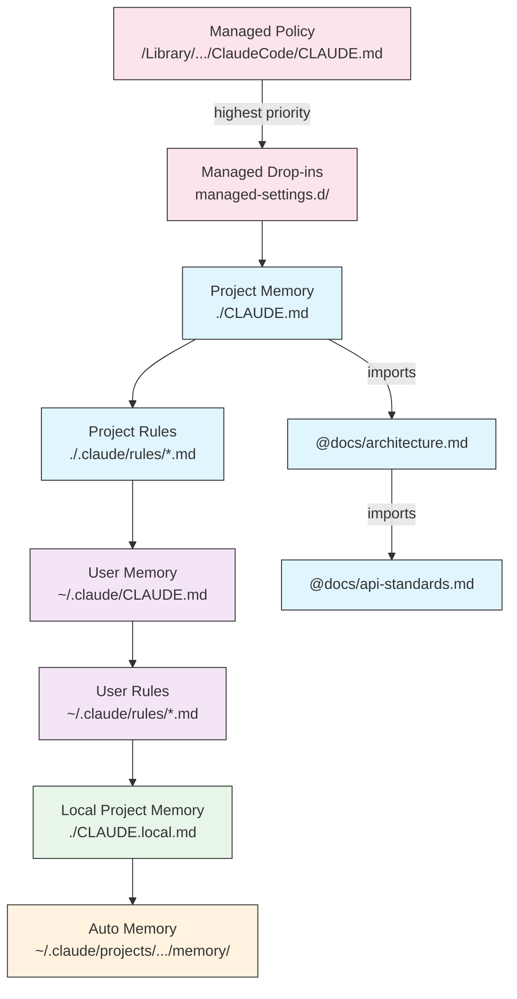
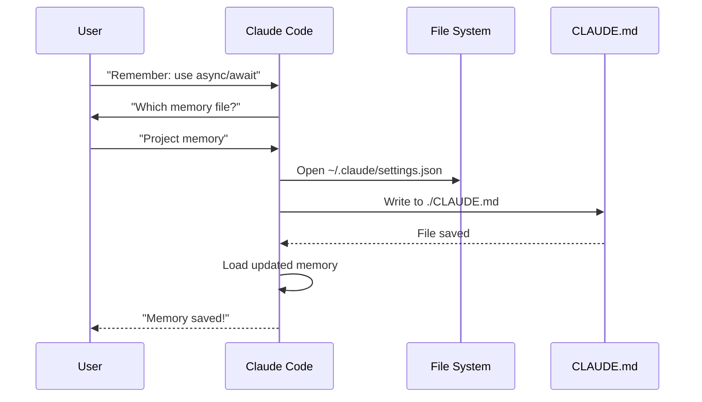
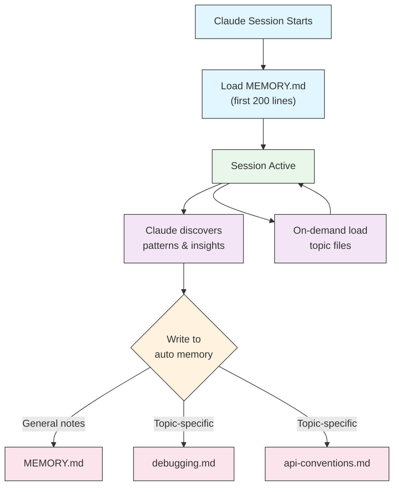

# Memory Guide

Memory enables Claude to retain context across sessions and conversations. It exists in two forms: automatic synthesis in claude.ai, and filesystem-based CLAUDE.md in Claude Code.

## Overview

Memory in Claude Code provides persistent context that carries across multiple sessions and conversations. Unlike temporary context windows, memory files allow you to:

- Share project standards across your team
- Store personal development preferences
- Maintain directory-specific rules and configurations
- Import external documentation
- Version control memory as part of your project

The memory system operates at multiple levels, from global personal preferences down to specific subdirectories, allowing for fine-grained control over what Claude remembers and how it applies that knowledge.

## Memory Commands Quick Reference

| 命令 | 用途 | 用法 | 使用场景 |
|---------|---------|-------|-------------|
| `/init` | 初始化项目记忆 | `/init` | 首次创建项目、首次设置 CLAUDE.md |
| `/memory` | 在编辑器中编辑记忆文件 | `/memory` | 大规模更新、重构、查看内容 |
| `#` 前缀 | 快速添加单行记忆 | `# 你的规则` | 在对话中快速添加规则 |
| `# new rule into memory` | 显式添加记忆 | `# new rule into memory<br/>你的详细规则` | 添加复杂的多行规则 |
| `# remember this` | 自然语言记忆 | `# remember this<br/>你的指令` | 对话式记忆更新 |
| `@path/to/file` | 导入外部内容 | `@README.md` 或 `@docs/api.md` | 在 CLAUDE.md 中引用现有文档 |

## Quick Start: Initializing Memory

### The `/init` Command

`/init` 命令是在 Claude Code 中设置项目记忆最快的方式。它会初始化一个包含项目基础文档的 CLAUDE.md 文件。

**用法：**

```bash
/init
```

**功能：**

- 在项目中创建一个新的 CLAUDE.md 文件（通常位于 `./CLAUDE.md` 或 `./.claude/CLAUDE.md`）
- 建立项目规范和指南
- 为跨会话的上下文持久化奠定基础
- 提供一个模板结构来记录你的项目标准

**增强交互模式：** 设置 `CLAUDE_CODE_NEW_INIT=true` 可以启用多阶段交互流程，逐步引导你完成项目设置：

```bash
CLAUDE_CODE_NEW_INIT=true claude
/init
```

**何时使用 `/init`：**

- 使用 Claude Code 开始一个新项目
- 建立团队编码标准和规范
- 创建关于代码库结构的文档
- 为协作开发设置记忆层级

**示例工作流程：**

```markdown
# 在你的项目目录中
/init

# Claude 创建包含如下结构的 CLAUDE.md：
# Project Configuration
## Project Overview
- Name: Your Project
- Tech Stack: [Your technologies]
- Team Size: [Number of developers]

## Development Standards
- Code style preferences
- Testing requirements
- Git workflow conventions
```

### Quick Memory Updates with `#`

你可以在任何对话中通过在消息开头加上 `#` 来快速添加信息到记忆：

**语法：**

```markdown
# Your memory rule or instruction here
```

**示例：**

```markdown
# Always use TypeScript strict mode in this project

# Prefer async/await over promise chains

# Run npm test before every commit

# Use kebab-case for file names
```

**工作原理：**

1. 在消息开头加上 `#` 后跟你的规则
2. Claude 识别这是记忆更新请求
3. Claude 询问要更新哪个记忆文件（项目或个人）
4. 规则被添加到相应的 CLAUDE.md 文件中
5. 未来的会话自动加载这个上下文

**替代模式：**

```markdown
# new rule into memory
Always validate user input with Zod schemas

# remember this
Use semantic versioning for all releases

# add to memory
Database migrations must be reversible
```

### The `/memory` Command

`/memory` 命令提供直接访问权限，可以在 Claude Code 会话中编辑你的 CLAUDE.md 记忆文件。它会在系统编辑器中打开你的记忆文件以便进行全面的编辑。

**用法：**

```bash
/memory
```

**功能：**

- 在系统默认编辑器中打开你的记忆文件
- 允许你进行大量的添加、修改和重组
- 提供对层级中所有记忆文件的直接访问
- 使你能够管理跨会话的持久化上下文

**何时使用 `/memory`：**

- 查看现有记忆内容
- 对项目标准进行大规模更新
- 重组记忆结构
- 添加详细的文档或指南
- 随着项目发展维护和更新记忆

**对比：`/memory` vs `/init`**

| 方面 | `/memory` | `/init` |
|--------|-----------|---------|
| **用途** | 编辑现有记忆文件 | 初始化新的 CLAUDE.md |
| **何时使用** | 更新/修改项目上下文 | 开始新项目 |
| **操作** | 打开编辑器进行更改 | 生成启动模板 |
| **工作流程** | 持续维护 | 一次性设置 |

**示例工作流程：**

```markdown
# 打开记忆进行编辑
/memory

# Claude 提供选项：
# 1. Managed Policy Memory
# 2. Project Memory (./CLAUDE.md)
# 3. User Memory (~/.claude/CLAUDE.md)
# 4. Local Project Memory

# 选择选项 2（项目记忆）
# 你的默认编辑器会打开 ./CLAUDE.md 的内容

# 进行更改，保存并关闭编辑器
# Claude 自动重新加载更新后的记忆
```

**使用记忆导入：**

CLAUDE.md 文件支持 `@path/to/file` 语法来包含外部内容：

```markdown
# Project Documentation
See @README.md for project overview
See @package.json for available npm commands
See @docs/architecture.md for system design

# Import from home directory using absolute path
@~/.claude/my-project-instructions.md
```

**导入功能：**

- 支持相对路径和绝对路径（例如 `@docs/api.md` 或 `@~/.claude/my-project-instructions.md`）
- 支持递归导入，最大深度为 5
- 首次从外部位置导入时会触发安全批准对话框
- 导入指令不会在 markdown 代码片段或代码块中求值（在示例中记录它们是安全的）
- 通过引用现有文档帮助避免重复
- 自动将引用的内容包含在 Claude 的上下文中

## Memory Architecture

Claude Code 中的记忆采用分层系统，不同层级服务于不同的目的：



## Memory Hierarchy in Claude Code

Claude Code 使用多层级记忆系统。记忆文件在 Claude Code 启动时自动加载，更高层级的文件具有优先级。

**完整记忆层级（按优先级顺序）：**

1. **Managed Policy** - 组织范围内的指令
   - macOS: `/Library/Application Support/ClaudeCode/CLAUDE.md`
   - Linux/WSL: `/etc/claude-code/CLAUDE.md`
   - Windows: `C:\Program Files\ClaudeCode\CLAUDE.md`

2. **Managed Drop-ins** - 按字母顺序合并的策略文件（v2.1.83+）
   - `managed-settings.d/` 目录，与 managed policy CLAUDE.md 同级
   - 文件按字母顺序合并，用于模块化策略管理

3. **Project Memory** - 团队共享的上下文（版本控制）
   - `./.claude/CLAUDE.md` 或 `./CLAUDE.md`（在仓库根目录）

4. **Project Rules** - 模块化的、主题特定的项目指令
   - `./.claude/rules/*.md`

5. **User Memory** - 个人偏好（所有项目）
   - `~/.claude/CLAUDE.md`

6. **User-Level Rules** - 个人规则（所有项目）
   - `~/.claude/rules/*.md`

7. **Local Project Memory** - 个人项目特定偏好
   - `./CLAUDE.local.md`

> **注意**：`CLAUDE.local.md` 未在 [官方文档](https://code.claude.com/docs/en/memory)（2026年3月）中提及。它可能仍然作为遗留功能工作。对于新项目，考虑使用 `~/.claude/CLAUDE.md`（用户级）或 `.claude/rules/`（项目级，路径范围）代替。

8. **Auto Memory** - Claude 的自动笔记和学习成果
   - `~/.claude/projects/<project>/memory/`

**记忆发现行为：**

Claude 按以下顺序搜索记忆文件，更早的位置具有优先级：



## Excluding CLAUDE.md Files with `claudeMdExcludes`

在大型 monorepo 中，某些 CLAUDE.md 文件可能与当前工作无关。`claudeMdExcludes` 设置允许你跳过特定的 CLAUDE.md 文件，使它们不会加载到上下文中：

```jsonc
// In ~/.claude/settings.json or .claude/settings.json
{
  "claudeMdExcludes": [
    "packages/legacy-app/CLAUDE.md",
    "vendors/**/CLAUDE.md"
  ]
}
```

模式与项目根目录的相对路径匹配。这特别适用于：

- 具有多个子项目的 monorepo，其中只有部分相关
- 包含 vendored 或第三方 CLAUDE.md 文件的仓库
- 通过排除过时或不相关的指令来减少 Claude 上下文窗口中的噪音

## Settings File Hierarchy

Claude Code 设置（包括 `autoMemoryDirectory`、`claudeMdExcludes` 和其他配置）从五级层级中解析，更高级别具有优先级：

| 级别 | 位置 | 范围 |
|-----|----------|-------|
| 1（最高） | Managed policy（系统级） | 组织范围内强制执行 |
| 2 | `managed-settings.d/`（v2.1.83+） | 模块化策略插件，按字母顺序合并 |
| 3 | `~/.claude/settings.json` | 用户偏好 |
| 4 | `.claude/settings.json` | 项目级（提交到 git） |
| 5（最低） | `.claude/settings.local.json` | 本地覆盖（git 忽略） |

**平台特定配置（v2.1.51+）：**

设置也可以通过以下方式配置：
- **macOS**：属性列表（plist）文件
- **Windows**：Windows 注册表

这些平台原生机制与 JSON 设置文件一起读取，并遵循相同的优先级规则。

## Modular Rules System

使用 `.claude/rules/` 目录结构创建有组织的、路径特定的规则。规则可以在项目级和用户级定义：

```
your-project/
├── .claude/
│   ├── CLAUDE.md
│   └── rules/
│       ├── code-style.md
│       ├── testing.md
│       ├── security.md
│       └── api/                  # 支持子目录
│           ├── conventions.md
│           └── validation.md

~/.claude/
├── CLAUDE.md
└── rules/                        # 用户级规则（所有项目）
    ├── personal-style.md
    └── preferred-patterns.md
```

规则在 `rules/` 目录中被递归发现，包括任何子目录。`~/.claude/rules/` 中的用户级规则在项目级规则之前加载，允许个人默认值可以被项目覆盖。

### Path-Specific Rules with YAML Frontmatter

定义仅适用于特定文件路径的规则：

```markdown
---
paths: src/api/**/*.ts
---

# API Development Rules

- All API endpoints must include input validation
- Use Zod for schema validation
- Document all parameters and response types
- Include error handling for all operations
```

**Glob 模式示例：**

- `**/*.ts` - 所有 TypeScript 文件
- `src/**/*` - src/ 下的所有文件
- `src/**/*.{ts,tsx}` - 多个扩展名
- `{src,lib}/**/*.ts, tests/**/*.test.ts` - 多个模式

### Subdirectories and Symlinks

`.claude/rules/` 中的规则支持两个组织功能：

- **子目录**：规则被递归发现，因此你可以将它们组织成基于主题的文件夹（例如 `rules/api/`、`rules/testing/`、`rules/security/`）
- **符号链接**：支持符号链接以在多个项目之间共享规则。例如，你可以将共享规则文件从中央位置符号链接到每个项目的 `.claude/rules/` 目录中

## Memory Locations Table

| 位置 | 范围 | 优先级 | 共享 | 访问 | 最适合 |
|----------|-------|----------|--------|--------|----------|
| `/Library/Application Support/ClaudeCode/CLAUDE.md` (macOS) | Managed Policy | 1（最高） | 组织 | 系统 | 公司范围策略 |
| `/etc/claude-code/CLAUDE.md` (Linux/WSL) | Managed Policy | 1（最高） | 组织 | 系统 | 组织标准 |
| `C:\Program Files\ClaudeCode\CLAUDE.md` (Windows) | Managed Policy | 1（最高） | 组织 | 系统 | 企业指南 |
| `managed-settings.d/*.md`（与策略同级） | Managed Drop-ins | 1.5 | 组织 | 系统 | 模块化策略文件（v2.1.83+） |
| `./CLAUDE.md` 或 `./.claude/CLAUDE.md` | Project Memory | 2 | 团队 | Git | 团队标准、共享架构 |
| `./.claude/rules/*.md` | Project Rules | 3 | 团队 | Git | 路径特定、模块化规则 |
| `~/.claude/CLAUDE.md` | User Memory | 4 | 个人 | 文件系统 | 个人偏好（所有项目） |
| `~/.claude/rules/*.md` | User Rules | 5 | 个人 | 文件系统 | 个人规则（所有项目） |
| `./CLAUDE.local.md` | Project Local | 6 | 个人 | Git（忽略） | 个人项目特定偏好 |
| `~/.claude/projects/<project>/memory/` | Auto Memory | 7（最低） | 个人 | 文件系统 | Claude 的自动笔记和学习成果 |

## Memory Update Lifecycle

以下是记忆更新如何在你的 Claude Code 会话中流动：



## Auto Memory

Auto memory 是一个持久化目录，Claude 在与你的项目合作时会自动记录学习成果、模式和见解。与你手动编写和维护的 CLAUDE.md 文件不同，auto memory 由 Claude 自己 在会话期间编写。

### How Auto Memory Works

- **位置**: `~/.claude/projects/<project>/memory/`
- **入口点**: `MEMORY.md` 作为 auto memory 目录的主文件
- **主题文件**: 针对特定主题的可选附加文件（例如 `debugging.md`、`api-conventions.md`）
- **加载行为**: `MEMORY.md` 的前 200 行在会话开始时加载到系统提示中。主题文件按需加载，不在启动时加载
- **读/写**: Claude 在会话期间读写记忆文件，因为它会发现模式和项目特定的知识

### Auto Memory Architecture



### Auto Memory Directory Structure

```
~/.claude/projects/<project>/memory/
├── MEMORY.md              # 入口点（前 200 行在启动时加载）
├── debugging.md           # 主题文件（按需加载）
├── api-conventions.md     # 主题文件（按需加载）
└── testing-patterns.md    # 主题文件（按需加载）
```

### Version Requirement

Auto memory 需要 **Claude Code v2.1.59 或更高版本**。如果你使用的是旧版本，请先升级：

```bash
npm install -g @anthropic-ai/claude-code@latest
```

### Custom Auto Memory Directory

默认情况下，auto memory 存储在 `~/.claude/projects/<project>/memory/`。你可以使用 `autoMemoryDirectory` 设置更改此位置（自 **v2.1.74** 起可用）：

```jsonc
// In ~/.claude/settings.json or .claude/settings.local.json (user/local settings only)
{
  "autoMemoryDirectory": "/path/to/custom/memory/directory"
}
```

> **注意**：`autoMemoryDirectory` 只能设置在用户级（`~/.claude/settings.json`）或本地设置（`.claude/settings.local.json`）中，不能设置在项目或 managed policy 设置中。

这在以下情况下很有用：

- 将 auto memory 存储在共享或同步的位置
- 将 auto memory 与默认 Claude 配置目录分开
- 使用默认层级之外的项目特定路径

### Worktree and Repository Sharing

同一 git 仓库中的所有 worktree 和子目录共享一个 auto memory 目录。这意味着在 worktree 之间切换或在同一个仓库的不同子目录中工作时，将读写相同的记忆文件。

### Subagent Memory

子代理（通过 Task 或并行执行等工具生成）可以有自己的记忆上下文。使用子代理定义中的 `memory` frontmatter 字段来指定要加载哪些记忆范围：

```yaml
memory: user      # 仅加载用户级记忆
memory: project   # 仅加载项目级记忆
memory: local     # 仅加载本地记忆
```

这允许子代理使用聚焦的上下文而不是继承完整的记忆层级。

### Controlling Auto Memory

Auto memory 可以通过 `CLAUDE_CODE_DISABLE_AUTO_MEMORY` 环境变量控制：

| 值 | 行为 |
|-------|----------|
| `0` | 强制开启 auto memory |
| `1` | 强制关闭 auto memory |
| *（未设置）* | 默认行为（auto memory 启用） |

```bash
# 为会话禁用 auto memory
CLAUDE_CODE_DISABLE_AUTO_MEMORY=1 claude

# 显式强制开启 auto memory
CLAUDE_CODE_DISABLE_AUTO_MEMORY=0 claude
```

## Additional Directories with `--add-dir`

`--add-dir` 标志允许 Claude Code 从当前工作目录之外的附加目录加载 CLAUDE.md 文件。这在 monorepo 或多项目设置中，当其他目录的上下文相关时很有用。

要启用此功能，请设置环境变量：

```bash
CLAUDE_CODE_ADDITIONAL_DIRECTORIES_CLAUDE_MD=1
```

然后使用标志启动 Claude Code：

```bash
claude --add-dir /path/to/other/project
```

Claude 将从指定的附加目录加载 CLAUDE.md，以及当前工作目录的记忆文件。

## Practical Examples

### Example 1: Project Memory Structure

**文件：** `./CLAUDE.md`

```markdown
# Project Configuration

## Project Overview
- **Name**: E-commerce Platform
- **Tech Stack**: Node.js, PostgreSQL, React 18, Docker
- **Team Size**: 5 developers
- **Deadline**: Q4 2025

## Architecture
@docs/architecture.md
@docs/api-standards.md
@docs/database-schema.md

## Development Standards

### Code Style
- Use Prettier for formatting
- Use ESLint with airbnb config
- Maximum line length: 100 characters
- Use 2-space indentation

### Naming Conventions
- **Files**: kebab-case (user-controller.js)
- **Classes**: PascalCase (UserService)
- **Functions/Variables**: camelCase (getUserById)
- **Constants**: UPPER_SNAKE_CASE (API_BASE_URL)
- **Database Tables**: snake_case (user_accounts)

### Git Workflow
- Branch names: `feature/description` or `fix/description`
- Commit messages: Follow conventional commits
- PR required before merge
- All CI/CD checks must pass
- Minimum 1 approval required

### Testing Requirements
- Minimum 80% code coverage
- All critical paths must have tests
- Use Jest for unit tests
- Use Cypress for E2E tests
- Test filenames: `*.test.ts` or `*.spec.ts`

### API Standards
- RESTful endpoints only
- JSON request/response
- Use HTTP status codes correctly
- Version API endpoints: `/api/v1/`
- Document all endpoints with examples

### Database
- Use migrations for schema changes
- Never hardcode credentials
- Use connection pooling
- Enable query logging in development
- Regular backups required

### Deployment
- Docker-based deployment
- Kubernetes orchestration
- Blue-green deployment strategy
- Automatic rollback on failure
- Database migrations run before deploy

## Common Commands

| 命令 | 用途 |
|---------|---------|
| `npm run dev` | 启动开发服务器 |
| `npm test` | 运行测试套件 |
| `npm run lint` | 检查代码风格 |
| `npm run build` | 为生产构建 |
| `npm run migrate` | 运行数据库迁移 |

## Team Contacts
- Tech Lead: Sarah Chen (@sarah.chen)
- Product Manager: Mike Johnson (@mike.j)
- DevOps: Alex Kim (@alex.k)

## Known Issues & Workarounds
- PostgreSQL connection pooling limited to 20 during peak hours
- Workaround: Implement query queuing
- Safari 14 compatibility issues with async generators
- Workaround: Use Babel transpiler

## Related Projects
- Analytics Dashboard: `/projects/analytics`
- Mobile App: `/projects/mobile`
- Admin Panel: `/projects/admin`
```

### Example 2: Directory-Specific Memory

**文件：** `./src/api/CLAUDE.md`

```markdown
# API Module Standards

This file overrides root CLAUDE.md for everything in /src/api/

## API-Specific Standards

### Request Validation
- Use Zod for schema validation
- Always validate input
- Return 400 with validation errors
- Include field-level error details

### Authentication
- All endpoints require JWT token
- Token in Authorization header
- Token expires after 24 hours
- Implement refresh token mechanism

### Response Format

All responses must follow this structure:

```json
{
  "success": true,
  "data": { /* actual data */ },
  "timestamp": "2025-11-06T10:30:00Z",
  "version": "1.0"
}
```

Error responses:
```json
{
  "success": false,
  "error": {
    "code": "VALIDATION_ERROR",
    "message": "User message",
    "details": { /* field errors */ }
  },
  "timestamp": "2025-11-06T10:30:00Z"
}
```

### Pagination
- Use cursor-based pagination (not offset)
- Include `hasMore` boolean
- Limit max page size to 100
- Default page size: 20

### Rate Limiting
- 1000 requests per hour for authenticated users
- 100 requests per hour for public endpoints
- Return 429 when exceeded
- Include retry-after header

### Caching
- Use Redis for session caching
- Cache duration: 5 minutes default
- Invalidate on write operations
- Tag cache keys with resource type
```

### Example 3: Personal Memory

**文件：** `~/.claude/CLAUDE.md`

```markdown
# My Development Preferences

## About Me
- **Experience Level**: 8 years full-stack development
- **Preferred Languages**: TypeScript, Python
- **Communication Style**: Direct, with examples
- **Learning Style**: Visual diagrams with code

## Code Preferences

### Error Handling
I prefer explicit error handling with try-catch blocks and meaningful error messages.
Avoid generic errors. Always log errors for debugging.

### Comments
Use comments for WHY, not WHAT. Code should be self-documenting.
Comments should explain business logic or non-obvious decisions.

### Testing
I prefer TDD (test-driven development).
Write tests first, then implementation.
Focus on behavior, not implementation details.

### Architecture
I prefer modular, loosely-coupled design.
Use dependency injection for testability.
Separate concerns (Controllers, Services, Repositories).

## Debugging Preferences
- Use console.log with prefix: `[DEBUG]`
- Include context: function name, relevant variables
- Use stack traces when available
- Always include timestamps in logs

## Communication
- Explain complex concepts with diagrams
- Show concrete examples before explaining theory
- Include before/after code snippets
- Summarize key points at the end

## Project Organization
I organize my projects as:

   project/
   ├── src/
   │   ├── api/
   │   ├── services/
   │   ├── models/
   │   └── utils/
   ├── tests/
   ├── docs/
   └── docker/

## Tooling
- **IDE**: VS Code with vim keybindings
- **Terminal**: Zsh with Oh-My-Zsh
- **Format**: Prettier (100 char line length)
- **Linter**: ESLint with airbnb config
- **Test Framework**: Jest with React Testing Library
```

_My Test_
Ask Claude to save a new rule


Claude has not save the rule because I did not have any `Claude.md` file anywhere. Then asked Claude to confirm the location.


### Example 4: Memory Update During Session

你可以在活动的 Claude Code 会话期间向记忆添加新规则。有两种方法可以做到这一点：

#### Method 1: Direct Request

```markdown
User: Remember that I prefer using React hooks instead of class components
     for all new components.

Claude: I'm adding that to your memory. Which memory file should this go in?
        1. Project memory (./CLAUDE.md)
        2. Personal memory (~/.claude/CLAUDE.md)

User: Project memory

Claude: ✅ Memory saved!

Added to ./CLAUDE.md:
---

### Component Development
- Use functional components with React Hooks
- Prefer hooks over class components
- Custom hooks for reusable logic
- Use useCallback for event handlers
- Use useMemo for expensive computations
```

#### Method 2: Using "# new rule into memory" Pattern

你也可以使用显式模式 "# new rule into memory" 来触发记忆更新：

```markdown
User: # new rule into memory
      Always validate user input with Zod schemas before processing.

Claude: I'm saving this rule to memory. Which memory file should I use?
        1. Project memory (./CLAUDE.md)
        2. Personal memory (~/.claude/CLAUDE.md)

User: Project memory

Claude: ✅ Memory saved!

Added to ./CLAUDE.md:
---

### Input Validation
- Always validate user input with Zod schemas before processing
- Define schemas at the top of each API handler file
- Return 400 status with validation errors
```

#### Tips for Adding Memory

- 在规则中要具体且可操作
- 将相关规则分组在章节标题下
- 更新现有章节而不是重复内容
- 选择适当的记忆范围（项目 vs 个人）

## Memory Features Comparison

| 特性 | Claude Web/Desktop | Claude Code (CLAUDE.md) |
|---------|-------------------|------------------------|
| 自动合成 | ✅ 每 24 小时 | ❌ 手动 |
| 跨项目 | ✅ 共享 | ❌ 项目特定 |
| 团队访问 | ✅ 共享项目 | ✅ Git 跟踪 |
| 可搜索 | ✅ 内置 | ✅ 通过 `/memory` |
| 可编辑 | ✅ 在聊天中 | ✅ 直接文件编辑 |
| 导入/导出 | ✅ 是 | ✅ 复制/粘贴 |
| 持久性 | ✅ 24 小时+ | ✅ 无限期 |

### Memory in Claude Web/Desktop

#### Memory Synthesis Timeline


**Example Memory Summary:**

```markdown
## Claude's Memory of User

### Professional Background
- Senior full-stack developer with 8 years experience
- Focus on TypeScript/Node.js backends and React frontends
- Active open source contributor
- Interested in AI and machine learning

### Project Context
- Currently building e-commerce platform
- Tech stack: Node.js, PostgreSQL, React 18, Docker
- Working with team of 5 developers
- Using CI/CD and blue-green deployments

### Communication Preferences
- Prefers direct, concise explanations
- Likes visual diagrams and examples
- Appreciates code snippets
- Explains business logic in comments

### Current Goals
- Improve API performance
- Increase test coverage to 90%
- Implement caching strategy
- Document architecture
```

## Best Practices

### Do's - What To Include

- **要具体和详细**：使用清晰、详细的指令，而不是模糊的指导
  - ✅ 好的做法："Use 2-space indentation for all JavaScript files"
  - ❌ 避免："Follow best practices"

- **保持有序**：用清晰的 markdown 部分和标题组织记忆文件

- **使用适当的层级**：
  - **Managed policy**：公司范围策略、安全标准、合规要求
  - **Project memory**：团队标准、架构、编码规范（提交到 git）
  - **User memory**：个人偏好、沟通风格、工具选择
  - **Directory memory**：模块特定规则和覆盖

- **利用导入**：使用 `@path/to/file` 语法引用现有文档
  - 支持最多 5 级递归嵌套
  - 避免记忆文件之间的重复
  - 示例：`See @README.md for project overview`

- **记录常用命令**：包括你重复使用的命令以节省时间

- **版本控制项目记忆**：将项目级 CLAUDE.md 文件提交到 git 以造福团队

- **定期审查**：随着项目发展和需求变化定期更新记忆

- **提供具体示例**：包括代码片段和具体场景

### Don'ts - What To Avoid

- **不要存储密钥**：永远不要包含 API 密钥、密码、令牌或凭据

- **不要包含敏感数据**：没有个人身份信息、私人信息或专有密钥

- **不要重复内容**：使用导入（`@path`）引用现有文档而不是复制

- **不要模糊**：避免"遵循最佳实践"或"写好代码"等通用声明

- **不要让它太长**：保持单个记忆文件专注且少于 500 行

- **不要过度组织**：战略性地使用层级；不要创建过多的子目录覆盖

- **不要忘记更新**：过时的记忆会导致混淆和过时的实践

- **不要超过嵌套限制**：记忆导入支持最多 5 级嵌套

### Memory Management Tips

**选择正确的记忆级别：**

| 用例 | 记忆级别 | 理由 |
|----------|-------------|-----------|
| 公司安全策略 | Managed Policy | 适用于组织内所有项目 |
| 团队代码风格指南 | Project | 通过 git 与团队共享 |
| 你喜欢的编辑器快捷键 | User | 个人偏好，不共享 |
| API 模块标准 | Directory | 仅特定于该模块 |

**快速更新工作流程：**

1. 对于单个规则：在对话中使用 `#` 前缀
2. 对于多个更改：使用 `/memory` 打开编辑器
3. 对于初始设置：使用 `/init` 创建模板

**导入最佳实践：**

```markdown
# Good: Reference existing docs
@README.md
@docs/architecture.md
@package.json

# Avoid: Copying content that exists elsewhere
# Instead of copying README content into CLAUDE.md, just import it
```

## Installation Instructions

### Setup Project Memory

#### Method 1: Using `/init` Command (Recommended)

设置项目记忆最快的方式：

1. **导航到你的项目目录：**
   ```bash
   cd /path/to/your/project
   ```

2. **在 Claude Code 中运行 init 命令：**
   ```bash
   /init
   ```

3. **Claude 会创建并填充 CLAUDE.md** 带有模板结构

4. **自定义生成的文件** 以匹配你的项目需求

5. **提交到 git：**
   ```bash
   git add CLAUDE.md
   git commit -m "Initialize project memory with /init"
   ```

#### Method 2: Manual Creation

如果你更喜欢手动设置：

1. **在你的项目根目录创建 CLAUDE.md：**
   ```bash
   cd /path/to/your/project
   touch CLAUDE.md
   ```

2. **添加项目标准：**
   ```bash
   cat > CLAUDE.md << 'EOF'
   # Project Configuration

   ## Project Overview
   - **Name**: Your Project Name
   - **Tech Stack**: List your technologies
   - **Team Size**: Number of developers

   ## Development Standards
   - Your coding standards
   - Naming conventions
   - Testing requirements
   EOF
   ```

3. **提交到 git：**
   ```bash
   git add CLAUDE.md
   git commit -m "Add project memory configuration"
   ```

#### Method 3: Quick Updates with `#`

一旦 CLAUDE.md 存在，在对话中快速添加规则：

```markdown
# Use semantic versioning for all releases

# Always run tests before committing

# Prefer composition over inheritance
```

Claude 会提示你选择要更新的记忆文件。

### Setup Personal Memory

1. **创建 ~/.claude 目录：**
   ```bash
   mkdir -p ~/.claude
   ```

2. **创建个人 CLAUDE.md：**
   ```bash
   touch ~/.claude/CLAUDE.md
   ```

3. **添加你的偏好：**
   ```bash
   cat > ~/.claude/CLAUDE.md << 'EOF'
   # My Development Preferences

   ## About Me
   - Experience Level: [Your level]
   - Preferred Languages: [Your languages]
   - Communication Style: [Your style]

   ## Code Preferences
   - [Your preferences]
   EOF
   ```

### Setup Directory-Specific Memory

1. **为特定目录创建记忆：**
   ```bash
   mkdir -p /path/to/directory/.claude
   touch /path/to/directory/CLAUDE.md
   ```

2. **添加目录特定规则：**
   ```bash
   cat > /path/to/directory/CLAUDE.md << 'EOF'
   # [Directory Name] Standards

   This file overrides root CLAUDE.md for this directory.

   ## [Specific Standards]
   EOF
   ```

3. **提交到版本控制：**
   ```bash
   git add /path/to/directory/CLAUDE.md
   git commit -m "Add [directory] memory configuration"
   ```

### Verify Setup

1. **检查记忆位置：**
   ```bash
   # Project root memory
   ls -la ./CLAUDE.md

   # Personal memory
   ls -la ~/.claude/CLAUDE.md